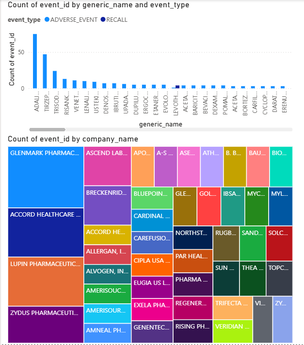

# 🚨 Drug Shortage Early-Warning System (Public Health Analytics Platform)

An end-to-end data product that ingests public health records from the openFDA API, loads them into a normalized PostgreSQL Star Schema data warehouse, applies time-series statistical modeling in Python, and surfaces real-time supply chain risk profiles in Power BI.

## 📊 Executive Dashboard Preview

---

## 💡 Project Summary & Business Impact
Hospital supply chains are traditionally reactive, discovering drug shortages only when manufacturing orders go unfulfilled. This project bridges that gap by transforming raw, messy public regulatory data into a predictive early-warning matrix.

### 📈 Key Results
* **Data Volume Processed:** Successfully extracted and transformed data across **186 unique generic medications** and hundreds of manufacturing plants.
* **Pipeline Automation:** Built a modular python execution framework that flattens deeply nested API JSON structures into structured datasets in less than 5 seconds.
* **Operational Signal:** Relationalized and isolated **464 severe manufacturing recalls (Class I and Class II)** from thousands of noisy public health records, providing data models a historical average severity benchmark of **2.1 / 3.0**.

---

## 🛠️ Tech Stack & Architecture
* **Ingestion Layer:** Python (`requests`, `pandas`) interacting with paginated openFDA endpoints.
* **Storage & Modeling:** PostgreSQL Data Warehouse using a custom Star Schema (`fact_regulatory_events`, `dim_drug`, `dim_manufacturer`).
* **Analytics Engine:** Python (`SQLAlchemy 2.0`, `numpy`) executing dynamic data aggregation and Z-score calculations.
* **BI Layer:** Power BI Desktop importing local database relations for diagnostic dashboarding.

---
